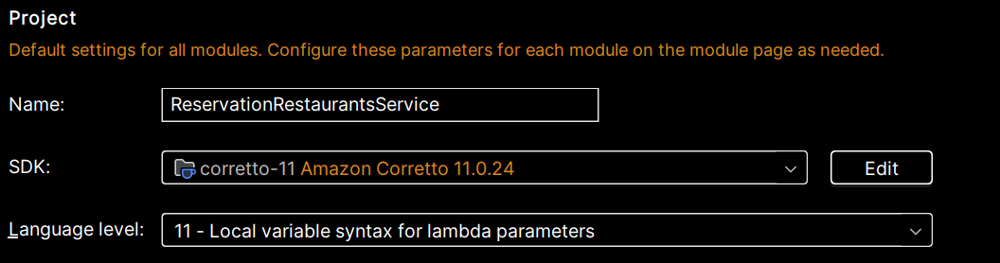

# Система Бронирования Столиков в Ресторане - Reservation Restaurants Service

_____

RESTful web-service, реализующей функционал с системой бронирования столиков любого ресторана. Приложение включает в себя возможности поиска ресторана, бронирование на любое количество гостей и дату,
проставление оценки и отзывов, просмотр текущей погоды местоположения ресторана на момент бронирования.
_____

## Оглавление

**[Основной стек](#Основной-стек)**<br>
**[Реализация. Общие пояснения к деталям](#Реализация.-Общие-пояснения-к-деталям)**<br>
**[Инструкции по установке](#Инструкции-по-установке)**<br>
**[Логирование](#Логирование)**<br>
**[Тестирование](#Тестирование)**<br>
**[Запросы](#Совместимость)**<br>
**[Примечание и прочее](Примечание-и-прочее)**<br>

_____________

## Основной стек

- **Java 11**
- **Gradle**
- **Spring Boot**
- **PostgreSQL**
- **Spring Security**
- **Spring Data**
- **Logging slf4j**
- **Lombok**

_Для тестирования использовался следующий стек:_

- **jUnit5**
- **Spring Boot Test**

________________

## Реализация

- Инициализация базы данных с использованием Hibernate со значением create-drop. При старте сервиса создаются автоматически таблицы в базе данных и сущность Админ, которые при завершении работы приложения Hibernate удаляет.
- Регистрация пользователя реализованы с помощью JWT аутентификации:
1) Пользователь обращается к сервису с запросом на регистрацию;
2) Переданные данные валидируются и на их основе создаётся объект пользователя, пароль шифруется при помощи PasswordEncoder;
3) Данные пользователя сохраняются в базу данных при помощи jpa-репозитория;
4) JwtService генерирует токен, который возвращается клиенту.

- Вход в аккаунт реализован с помощью следующих шагов:
1) Пользователь обращается с запросом на вход;
2) Создаётся экземпляр объекта UsernamePasswordAuthenticationToken и при помощи AuthenticationManager происходят все необходимые проверки;
3) Если всё прошло успешно - будет возвращён токен, если нет, ошибка 403.

- Через Spring Security реализованы 3 роли: "USER", "ADMIN", "MANAGER" с помощью которых происходит распределение прав доступа к ресурсам;
- В приложении появились отзывы на рестораны. Пользователь может оставлять отзыв на любое заведение;
- Добавлен функционал подсчета рейтинга каждого ресторана. При создании ресторана рейтинг равен нулю, а затем изменяется в зависимости от оценки пользователя;

_________________

## Основные сущности и назначение:

- User (Пользователь) содержит поля: id, username, surname, nickname, email, password, phoneNumber, userRole,
  userStatus;
- Restaurant (Ресторан) содержит поля: id, name, address, phoneNumber, rating, lat, lon;
- Reservation (Бронирование) содержит поля: id, creationTime, guests, status, timeOfStatusChange;
- Review (Отзыв) содержит поля: id, review;
- AuditorEntities содержит поля: createdDate, modifiedDate;
- CRUD для работы с вышеперечисленными сущностями;
- Получение прогноза погоды при бронировании на конкретную дату;

## Инструкции по установке

### Системные требования
В данном репозитории представлено backend приложение. Работоспособность приложения протестирована по WEB API с помощью
Postman-тестов.

Приложение работает корректно в текущем виде при наличии:

- установленный [JDK версии 11](https://docs.aws.amazon.com/corretto/);
- сборка с использованием [Gradle](https://gradle.org/)

_____________________________________________
Чтобы клонировать репозиторий с GitHub, используйте следующую ссылку:

```
https://github.com/MariaK0511/ReservationRestaurantsService.git
```

В IntelliJ IDEA выбираем File-> New -> Project from Version Control -> Git  вводим адрес ссылки репозитория на GitHub. В поле Directory выбираем каталог файловой системы, куда будет скопирован проект. Далее нажимаем кнопку Clone.
Созданный проект необходимо настроить. В поле SDK выбрать текущую версию Java, в поле Language level желательно выбрать уровень языка соответствующий выбранному SDK:


_____________________________________________

При запуске проекта локально (не в docker контейнере) создайте у себя базу данных с параметрами:

- url:  jdbc:postgresql://localhost:5432/postgres
- username: postgres
- password: root

## Логирование

Логи хранятся в папке resources/logs

_________________

## Тестирование

## Запросы

<details>
  <summary>Список User запросов</summary>

#### 1. POST запрос на регистрацию User http://localhost:8080/registration с телом:

```
{
  "username": "Jerry",
  "surname": "Smith",
  "nickname": "Jerry91",
  "email": "jerry91@gmail.com",
  "password": "MGLI9K3NzjZ9KsI",
  "phoneNumber": "80293773456",
  "userRole": "USER"
}
```
Создаёт пользователя и возвращает ответ, присваивая пользователю пустой id, который будет присвоен пользователю после входа в систему

```
{
 "id": 2,
 "username": "Jerry",
 "surname": "Smith",
 "nickname": "Jerry91",
 "email": "jerry91@gmail.com",
 "password": "MGLI9K3NzjZ9KsI",
 "phoneNumber": "80293773456",
 "userRole": "USER"
}
```

#### 2. POST запрос http://localhost:8080/login на вход в сервис

```
{
 "email": "jerry91@gmail.com",
 "password": "MGLI9K3NzjZ9KsI",
}
```
Если email и password правильные, то ответ будет уникальный токен.

#### 3. GET запрос http://localhost:8080/user/{userId} где userId = 2 даст ответ
```
Authorization: Bearer_xxxxx.yyyyy.zzzzz

{
 "id": 2,
 "username": "Jerry",
 "surname": "Smith",
 "nickname": "Jerry91",
 "email": "jerry91@gmail.com",
 "password": "MGLI9K3NzjZ9KsI",
 "phoneNumber": "80293773456",
 "userRole": "USER"
}
```

#### 4. GET запрос http://localhost:8080/users вернёт список всех пользователей

```
Authorization: Bearer_xxxxx.yyyyy.zzzzz

[
  {
    "id": 1,
    "username": "Mary",
    "surname": "Mikh",
    "nickname": "MaryMikh",
    "email": "mary@gmail.com",
    "password": "$2a$10$btyzEpYXmYceuN61mk45GuQ3j8yx2Vdd1yTAWl/80g0O6o6N.74O.",
    "phoneNumber": "80448878709",
    "userRole": "ADMIN"
  },
  {
    "id": 2,
    "username": "Jerry",
    "surname": "Smith",
    "nickname": "Jerry91",
    "email": "jerry91@gmail.com",
    "password": "$2a$10$aGeAtq3hXDlGzojQThHsw.OyTMKlcPrcR157KkMU0ous.YfB/Q.Ri",
    "phoneNumber": "+80293773456",
    "userRole": "USER"
  }
```

#### 5. PUT запрос http://localhost:8080/user/{userId} где userId = 2 с телом

```
{
  "username": "Jerry",
  "surname": "Smith",
  "nickname": "Jerry92",
  "email": "jerry91@gmail.com",
  "password": "MGLI9K3NzjZ9KsI",
  "phoneNumber": 80293773456,
  "userRole": "USER"
}
```

Обновит поля и вернёт обновленные данные:
```
{
  "username": "Jerry",
  "surname": "Smith",
  "nickname": "Jerry92",
  "email": "jerry91@gmail.com",
  "password": "MGLI9K3NzjZ9KsI",
  "phoneNumber": 80293773456,
  "userRole": "USER"
}
```
#### 6. DELETE запрос http://localhost:8080/{userId} где userId = 2 даст ответ без тела , со статусом 201 No Content:
```
<Response body is empty>
```
*Повторный запрос на этот же адрес будет возвращать один и тот же ответ, так как запрос идемпотентный, что и требуется по REST*


</details>

<details>
  <summary>Список Restaurant запросов</summary>

запросы создаются только если UserRole = "ADMIN" 

#### 1. POST запрос на создание Ресторана  http://localhost:8080/restaurant/save с телом:

```
Authorization: Bearer_xxxxx.yyyyy.zzzzz

{
  "name": "Vasilki",
  "address": "prasp. Niezaliežnasci 16",
  "phoneNumber": "80296547809",
  "rating": 4,
  "lat": 53.9006,
  "lon": 27.5590,
  "weatherDto": { }
}
```
Создаёт ресторан и возвращает ответ с присвоенным ресторану id:

```
{
  "id": 2,
  "name": "Vasilki",
  "address": "prasp. Niezaliežnasci 16",
  "phoneNumber": "+80296547809",
  "rating": 4,
  "lat": 53.9006,
  "lon": 27.559,
  "weatherDto": null
}
```


#### 2. GET запрос http://localhost:8080/restaurant/{restaurantId}?wantWeather = true/false где restaurantId = 2 даст ответ:
```
Authorization: Bearer_xxxxx.yyyyy.zzzzz

{
  "id": 2,
  "name": "Vasilki",
  "address": "prasp. Niezaliežnasci 16",
  "phoneNumber": "80296547809",
  "rating": 4,
  "lat": 53.9006,
  "lon": 27.5590,
  "weatherDto": { }
}
```

Вернёт тело ответа вместе с текущей погодой:

```
{
  "id": 2,
  "name": "Vasilki",
  "address": "prasp. Niezaliežnasci 16",
  "phoneNumber": "+80296547809",
  "rating": 4,
  "lat": 53.9006,
  "lon": 27.559,
  "weatherDto": {
    "temperature": 298.01,
    "typeOfWeather": "clear sky"
  }
}
```

#### 3. GET запрос http://localhost:8080/restaurant/restaurants вернёт список всех ресторанов:

```
Authorization: Bearer_xxxxx.yyyyy.zzzzz

[
  {
    "id": 1,
    "name": "Patrick Pub",
    "address": "str.Hiercena, 4",
    "phoneNumber": "+375296199865",
    "rating": 0,
    "lat": 53.893009,
    "lon": 27.567444,
    "weatherDto": null
  },
  {
    "id": 2,
    "name": "Vasilki",
    "address": "prasp. Niezaliežnasci 16",
    "phoneNumber": "+80296547809",
    "rating": 4,
    "lat": 53.9006,
    "lon": 27.559,
    "weatherDto": null
  }
]
```

#### 4. PUT запрос http://localhost:8080/restaurant/{restaurantId} где restaurantId = 2 с телом, в котором обновляем поле "rating":

```
Authorization: Bearer_xxxxx.yyyyy.zzzzz

{
  "name": "Vasilki",
  "address": "prasp. Niezaliežnasci 16",
  "phoneNumber": "80293337809",
  "rating": 5,
  "lat": 53.9006,
  "lon": 27.5590,
  "weatherDto": {}
}
```

Обновит необходимые поля и вернёт обновленные данные:
```
{
  "id": 2,
  "name": "Vasilki",
  "address": "prasp. Niezaliežnasci 16",
  "phoneNumber": "+80293337809",
  "rating": 5,
  "lat": 53.9006,
  "lon": 27.559,
  "weatherDto": null
}
```

#### 5. GET запрос http://localhost:8080/restaurant/{restaurantId}/reservations где restaurantId = 2, вернёт список всех резерваций:

```
Authorization: Bearer_xxxxx.yyyyy.zzzzz

[
  {
    "id": 2,
    "creationTime": "2024-08-16T12:10:32.370532",
    "status": "ACTIVE",
    "timeStatusChange": "2024-08-16T12:11:32.392396",
    "guests": 5
  },
  {
    "id": 3,
    "creationTime": "2024-08-16T12:12:04.966571",
    "status": null,
    "timeStatusChange": null,
    "guests": 2
  }
]
```
#### 6. DELETE запрос http://localhost:8080/restaurant/{restaurantId} где restaurantId = 2 даст ответ без тела , со статусом 201 No Content:

```
<Response body is empty>
```
*Повторный запрос на этот же адрес будет возвращать один и тот же ответ, так как запрос идемпотентный, что и требуется по REST*

```
Response code: 403;
```

</details>


<details>
  <summary>Список Reservation запросов</summary>

запросы создаются только если UserRole = "ADMIN"

#### 1. POST запрос на создание Резервации http://localhost:8080/reservation/restaurant/2/user/2/reservation с телом:

```
{
  "creationTime": "",
  "status": "ACTIVE",
  "timeStatusChange": "",
  "guests": 5
}
```
Создаёт резервацию и возвращает ответ, добавляя текущее время создания, а также присваивает id:

```
{
  "id": 2,
  "creationTime": "2024-08-09T16:17:45.8123252",
  "status": null,
  "timeStatusChange": null,
  "guests": 5
}
```


#### 2. GET запрос http://localhost:8080/reservation/restaurant/2 где reservationId = 2 даст ответ:
```
Authorization: Bearer_xxxxx.yyyyy.zzzzz

{
  "id": 2,
  "creationTime": "2024-08-16T12:18:57.012416",
  "status": null,
  "timeStatusChange": null,
  "guests": 5
}
```

#### 3. GET запрос http://localhost:8080/reservation/restaurant/reservations вернёт список всех резерваций:

```
Authorization: Bearer_xxxxx.yyyyy.zzzzz

[
  {
    "id": 1,
    "creationTime": "2024-08-16T14:37:56.385811",
    "status": "RESERVED",
    "timeStatusChange": "2024-08-16T14:37:56.385811",
    "guests": 2
  },
  {
    "id": 2,
    "creationTime": "2024-08-16T14:39:11.775042",
    "status": null,
    "timeStatusChange": null,
    "guests": 2
  }
]
```

#### 4. PUT запрос http://localhost:8080/reservation/restaurant/{reservationId} где reservationId = 2 с телом, в котором обновляем поле "guests":

```
Authorization: Bearer_xxxxx.yyyyy.zzzzz

{
  "creationTime": "",
  "status": "ACTIVE",
  "timeStatusChange": "",
  "guests": 4
}
```

Обновит необходимые поля и вернёт обновленные данные:
```
{
  "id": 2,
  "creationTime": "2024-08-16T14:39:11.775042",
  "status": "ACTIVE",
  "timeStatusChange": "2024-08-16T14:43:25.176322",
  "guests": 4
}
```

#### 5. PUT запрос http://localhost:8080/reservation/status/restaurant/{{restaurantId}}/reservation/{{reservationId}}/reservationStatus чтобы установите статус бронирования по идентификатору ресторана и идентификатору бронирования, 
где restaurantId = 2, вернёт список всех резерваций и reservationId = 2:

```
Authorization: Bearer_xxxxx.yyyyy.zzzzz

{
  "creationTime": "",
  "status": "INACTIVE",
  "timeStatusChange": "",
  "guests": 4
}
```

Вернёт тело ответа с временем изменения статуса:

```
{
  "id": 2,
  "creationTime": "2024-08-16T15:17:01.379404",
  "status": "INACTIVE",
  "timeStatusChange": "2024-08-16T15:19:18.1583065",
  "guests": 2
}
```
#### 6. DELETE запрос http://localhost:8080/reservation/restaurant/{reservationId} где reservationId = 2 даст ответ без тела , со статусом 201 No Content:
```
<Response body is empty>
```
*Повторный запрос на этот же адрес будет возвращать один и тот же ответ, так как запрос идемпотентный, что и требуется по REST*

```
Response code: 403;
```

</details>

<details>
  <summary>Список Review запросов</summary>

запросы создаются только если UserRole = "ADMIN"

#### 1. POST запрос на создание Отзыва http://localhost:8080/restaurant/{{restaurantId}}/user/{{userId}}/review где restaurantId = 2 и userId = 2 с телом:

```
Authorization: Bearer_xxxxx.yyyyy.zzzzz

{
  "review": "Good service!"
}
```
Создаёт резервацию и возвращает ответ, присваивая id:

```
{
  "id": 0,
  "review": "Good service!"
}
```

#### 4. PUT запрос http://localhost:8080/restaurant/review/{reviewId} где reviewId = 2 с телом, в котором обновляем поле "review":

```
Authorization: Bearer_xxxxx.yyyyy.zzzzz

{
  "review": "Excellent service!"
}
```

Обновит review поле и вернёт обновленные данные:
```
{
  "id": 0,
  "review": "Excellent service!"
}
```


#### 6. DELETE запрос http://localhost:8080/restaurant/review/{reviewId} где reviewId = 2 даст ответ без тела , со статусом 201 No Content:
```
<Response body is empty>
```
*Повторный запрос на этот же адрес будет возвращать один и тот же ответ, так как запрос идемпотентный, что и требуется по REST*

```
Response code: 403;
```

#### 3. GET запрос http://localhost:8080/restaurant/{restaurantId}/reviews где restaurantId = 2, вернёт список всех отзывов ресторана:

```
Authorization: Bearer_xxxxx.yyyyy.zzzzz

[
  {
    "id": 1,
    "review": "Delicious meat dishes"
  },
  {
    "id": 2,
    "review": "Excellent service!"
  }
]
```

#### 2. GET запрос http://localhost:8080/user/{reviewId}/reviews где reviewId = 2 даст ответ:
```
Authorization: Bearer_xxxxx.yyyyy.zzzzz

[
 {
    "id": 2,
    "review": "Excellent service!"
 }
]
```

</details>

## Примечание и прочее

___
[Оглавление](#Оглавление)